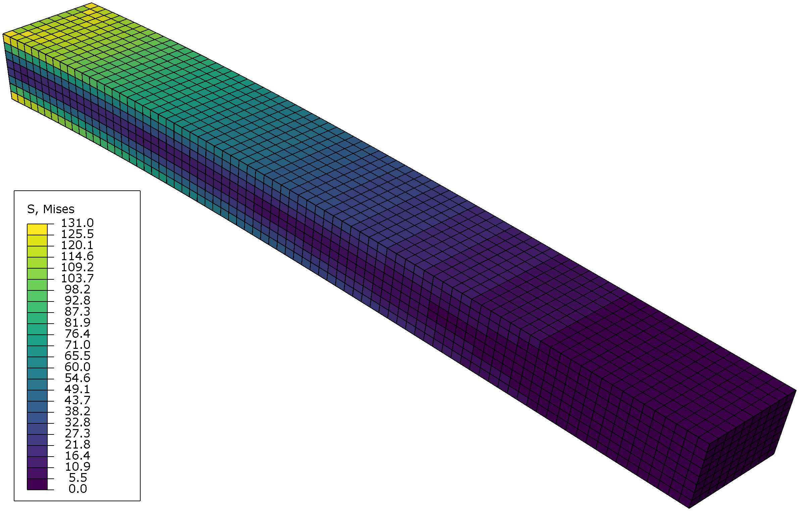
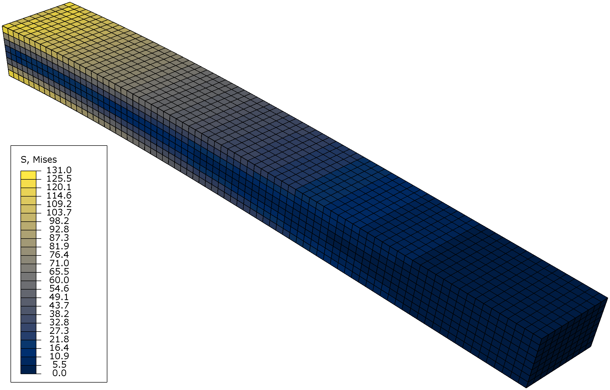
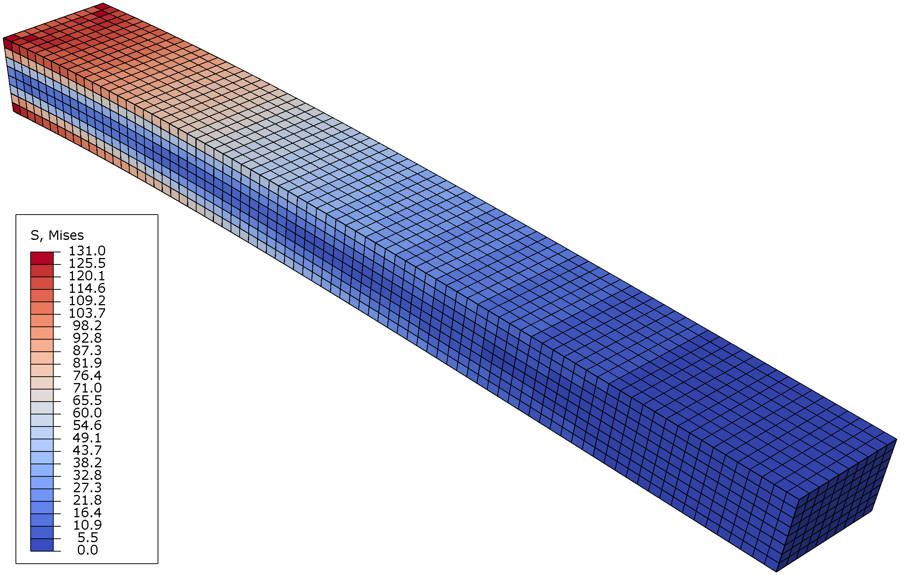

# BeautifulABQ

_(the repository formerly known as `ViridisABQ`)_

## What? Why?

If from time to time you create scientific visualizations, it is likely that you do so with one of these softwares that use a beautiful rainbow color map. Well ... nope. It's not beautiful. It's evil. These rainbow color maps we all know by heart? They show us things that aren't even there. And the next moment they hide the rest from us.

Please see for yourself:

- [How Bad Is Your Colormap? (Or, Why People Hate Jet – and You Should Too) | Pythonic Perambulations](https://jakevdp.github.io/blog/2014/10/16/how-bad-is-your-colormap/)
- [Why you should never use 'jet' colormap | Chong-Chong He](https://chongchonghe.github.io/post/colormap/)
- [A dangerous rainbow: Why colormaps matter. » Behind the Headlines - MATLAB & Simulink](https://blogs.mathworks.com/headlines/2018/10/10/a-dangerous-rainbow-why-colormaps-matter/)

## A nicely colored picture is worth a thousand words

But thanks to some great creatures, help is at hand: cleverly optimized colormaps for __sequential__ and for __diverging__ datasets. And here you can download them for the FEM software [Abaqus CAE - SIMULA™ by Dassault Systèmes®](https://www.3ds.com/products-services/simulia/products/abaqus/abaquscae/).

From now on, you can paint your Abaqus simulations in:

- [`Viridis`](https://bids.github.io/colormap/) for __sequential__ data or
- [`Cividis`](https://doi.org/10.1371/journal.pone.0199239) (basically Viridis compensated for color vision deficiencies) and
- [`Cool2Warm`](https://doi.org/10.1007/978-3-642-10520-3_9) for __diverging__ data

### Simple beam FEM analysis colored with Viridis

### Simple beam FEM analysis colored with Cividis

### Simple beam FEM analysis colored with Cool2Warm

## You want it? You shall get it!

Copy `abaqus_v6.env` into your home directory or any other directory where Abaqus searches for environment files.
Have a look at Abaqus Installation and Licensing Guide, chapter 4.1 to see where these directories might be. You can reach the guide from *Abaqus -> Help -> Search & Browse Guides... -> Abaqus Installation and Licensing Guide*.

If you already have an `abaqus_v6.env` file or even use an `onCaeStartup()` routine, simply copy the contents from this repository to the appropriate place.

Abaqus will load the instructions at start-up and automatically make `Viridis`, `Cividis` and `Cool2Warm` available in the _Visualization_ module.

## License

This file and the colormap in it are released under the CC0 license / public domain dedication. We would appreciate credit if you use or redistribute these colormaps, but do not impose any legal restrictions.

To the extent possible under law, the person who associated CC0 with this work has waived all copyright and related or neighboring rights to this work.

You should have received a copy of the CC0 legalcode along with this work.  If not, see [Creative Commons — CC0 1.0 Universal](https://creativecommons.org/publicdomain/zero/1.0/).
