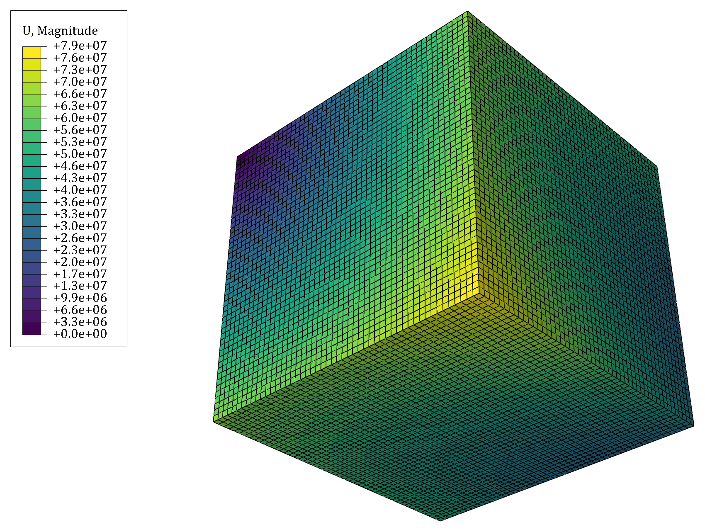
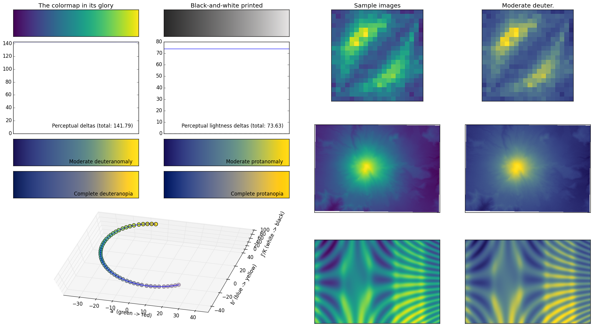

# ViridisABQ
This snippet adds the fabulous Viridis colormap from Python's [matplotlib](https://matplotlib.org/) to [Simulia Abaqus/CAE](https://en.wikipedia.org/wiki/Abaqus). Viridis has nothing but great advantages over the standard rainbow colormap (often called “jet”). All you have to do is use it.

Copy `abaqus_v6.env` into your home directory or any other directory where Abaqus searches for environment files.
Have a look at Abaqus Installation and Licensing Guide, chapter 4.1 to see where these directories might be. You can reach the guide from *Abaqus -> Help -> Search & Browse Guides... -> Abaqus Installation and Licensing Guide*.

If you already have an `abaqus_v6.env` file or even use an `onCaeStartup()` routine, simply copy the contents from this repository to the appropriate place.

Abaqus will load the instructions at start-up and automatically use Viridis in the Visualization module.

For some background information on Viridis and why it's better than rainbow and for explanations to the image below, please have a look at: [mpl colormaps](https://bids.github.io/colormap/)

## Viridis for other software

If you are so adventurous and use [Matlab](https://en.wikipedia.org/wiki/MATLAB), you can find Viridis here: [Perceptually uniform colormaps -  File Exchange - MATLAB Central](https://de.mathworks.com/matlabcentral/fileexchange/51986-perceptually-uniform-colormaps?requestedDomain=true).

For you [gnuplot](https://en.wikipedia.org/wiki/Gnuplot) apologists, there's Viridis here: [Gnuplotting/gnuplot-palettes: Color palettes for gnuplot](https://github.com/Gnuplotting/gnuplot-palettes)

## License

This file and the colormap in it are released under the CC0 license / public domain dedication. We would appreciate credit if you use or redistribute these colormaps, but do not impose any legal restrictions.

To the extent possible under law, the person who associated CC0 with this work has waived all copyright and related or neighboring rights to this work.

You should have received a copy of the CC0 legalcode along with this work.  If not, see [Creative Commons — CC0 1.0 Universal](https://creativecommons.org/publicdomain/zero/1.0/).
